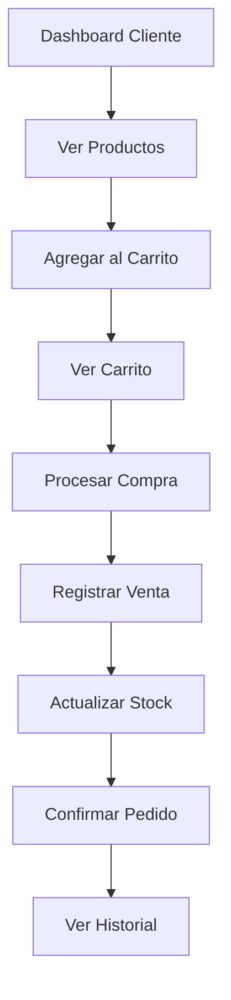

# 📊 Análisis y Arquitectura Dashboard Cliente

## 🔍 ANÁLISIS COMPLETO DEL PROYECTO EXISTENTE

### 1️⃣ **Frontend Confirmado** ✅
- **Vite + React 18**: Configuración optimizada
- **React Router DOM v6**: Manejo de rutas dinámicas
- **Ant Design v6**: Componentes UI profesionales
- **TailwindCSS**: Utilidades CSS
- **Dependencias clave**:
  - Axios (API)
  - Embla Carousel (Carruseles)
  - Framer Motion (Animaciones)
  - Recharts (Gráficos)
  - SweetAlert2 (Alertas)
  - JWT Decode (Autenticación)

### 2️⃣ **Backend Analizado** ✅
- **Node.js + Express**: Servidor robusto
- **Prisma ORM**: Gestión de base de datos con MySQL
- **JWT con roles**: Sistema de autenticación maduro
- **Arquitectura modular**: Servicio/Controlador/Rutas

### 3️⃣ **Modelos Prisma Claves** 🔥

#### Usuario (Cliente)
```prisma
model Usuario {
  idUsuario         Int       
  nombres           String    
  apellidos         String    
  correoElectronico String    
  telefono          String?   
  direccion         String?   
  idRol             Int        // 2 = CLIENTE
  estado            EstadoUsuario
  // ... relaciones completas
}
```

#### Venta (Flujo Admin → Cliente)
```prisma
model Venta {
  idVenta              Int       
  idUsuario            Int       // Cliente que compra
  idUsuarioVendedor    Int?      // Vendedor (opcional)
  idEstadoPedido       Int       
  subtotal             Decimal   
  total                Decimal   
  totalPagado          Decimal   
  saldoPendiente       Decimal   
  tipoVenta            TipoVenta  // contado, mixto, credito
  estadoPago           EstadoPago
  // ... relaciones con DetalleVenta, Pagos, Creditos
}
```

#### VarianteProducto (Inventario)
```prisma
model VarianteProducto {
  idVariante    Int       
  idProducto    Int       
  idColor       Int?      
  idTalla       Int?      
  codigoSku     String    
  precioVenta   Decimal    // Precio para cliente
  precioCosto   Decimal    // Costo de compra
  cantidadStock Decimal    // Stock actual
  stockMinimo   Decimal    
  stockMaximo   Decimal    
  // ... relaciones con imágenes, movimientos
}
```

### 4️⃣ **Estructura Frontend Actual** 🏗️

```
Frontend/src/
├── components/
│   └── public/          # Componentes públicos existentes
├── pages/
│   ├── public/          # Páginas públicas
│   └── admin/           # Dashboard admin completo
├── context/
│   ├── AuthContext.jsx  # Autenticación ✅
│   └── CarritoContext.jsx # Carrito ✅
├── api/                 # APIs completas ✅
└── routes/
    ├── AppRoutes.jsx    # Rutas principales ✅
    ├── AdminRoutes.jsx  # Rutas admin ✅
    └── ClienteRoutes.jsx # ⚠️ YA EXISTE (incompleto)
```

### 5️⃣ **ClienteRoutes.jsx Actual** 📋

**Estado**: Basal implementado
```jsx
// Rutas existentes (vacías)
- /cliente/dashboard    → ClienteDashboardPage
- /cliente/tienda       → TiendaPage  
- /cliente/pedidos      → PedidosPage
- /cliente/perfil       → PerfilPage
- /cliente/producto/:id → ProductoPage
```

## 🎯 **ARQUITECTURA PROPUESTA - DASHBOARD CLIENTE**

### 6️⃣ **Estructura Completa a Construir** 🏗️

```
Frontend/src/
├── components/cliente/
│   ├── layout/
│   │   ├── ClienteLayout.jsx        # Layout principal
│   │   ├── ClienteSidebar.jsx       # Navegación lateral
│   │   └── ClienteHeader.jsx        # Header con perfil
│   ├── metricas/
│   │   ├── MetricasDashboard.jsx    # Cards con métricas
│   │   ├── GraficoCompras.jsx       # Recharts
│   │   └── EstadisticasCliente.jsx  # Componentes estadísticos
│   ├── carrusel/
│   │   ├── ProductosCarrusel.jsx    # Embla Carousel
│   │   └── CarruselCard.jsx         # Cards productos
│   ├── cards/
│   │   ├── ProductoCard.jsx         # Card producto individual
│   │   ├── PedidoCard.jsx           # Card de pedido
│   │   └── PerfilCard.jsx           # Card de información
│   ├── formularios/
│   │   ├── PerfilForm.jsx           # Formulario perfil
│   │   ├── BusquedaForm.jsx         # Búsqueda productos
│   │   └── FiltrosForm.jsx          # Filtros avanzados
│   └── carrito/
│       ├── CarritoIcon.jsx          # Icono del carrito
│       ├── CarritoModal.jsx         # Modal carrito
│       └── CarritoItem.jsx          # Item carrito
├── pages/cliente/
│   ├── dashboard/
│   │   └── index.jsx                # Dashboard principal
│   ├── perfil/
│   │   └── index.jsx                # Perfil y configuración
│   ├── compras/
│   │   └── index.jsx                # Tienda de productos
│   ├── carrito/
│   │   └── index.jsx                # Carrito de compras
│   └── pedidos/
│       └── index.jsx                # Historial de pedidos
```

### 7️⃣ **Flujo de Compras (CRÍTICO)** 🔄

#### **Análisis Flujo ADMIN existente**:
1. **Selección de productos** → Desde inventario
2. **Gestión de variantes** → Colores/Tallas con stock
3. **Cálculo de totales** → Precios de variantes
4. **Registro de venta** → Con cliente asignado
5. **Actualización de stock** → Movimientos automáticos
6. **Gestión de pagos** → Métodos múltiples
7. **Generación de créditos** → Si aplica

#### **Replicación para CLIENTE**:


### 8️⃣ **Endpoints Necesarios** 🔌

#### **Ventas para Clientes**:
```javascript
// Ya existen en backend, solo adaptarlas para cliente
GET /api/ventas/usuario/:idUsuario     // Ventas del cliente
GET /api/ventas/:id                    // Detalles venta específica
POST /api/ventas                      // Nueva venta (cliente)
GET /api/productos/public             // Productos públicos
GET /api/variantes/public/:idProducto // Variantes de producto
```

#### **Métricas Cliente**:
```javascript
// Nuevos endpoints necesarios
GET /api/clientes/:id/metricas         // Estadísticas cliente
GET /api/clientes/:id/compras          // Historial compras
GET /api/clientes/:id/pedidos          // Pedidos activos
```

### 9️⃣ **Componentes Clave - Diseño Mobile-First** 📱

#### **ClienteLayout.jsx**:
- **Header**: Logo, buscador, carrito, perfil
- **Sidebar**: Dashboard, Tienda, Pedidos, Perfil
- **Footer**: Enlaces rápidos, contacto
- **Responsive**: Colapso automático en móvil

#### **MetricasDashboard.jsx**:
```jsx
// Usando Ant Design + Recharts
<Row gutter={[16, 16]}>
  <Col xs={24} sm={12} lg={6}>
    <Card><Statistic title="Total Compras" value={totalCompras}/></Card>
  </Col>
  <Col xs={24} sm={12} lg={6}>
    <Card><Statistic title="Total Gastado" value={totalGastado} prefix="$"/></Card>
  </Col>
  <Col xs={24} sm={12} lg={6}>
    <Card><Statistic title="Pedidos" value={cantidadPedidos}/></Card>
  </Col>
  <Col xs={24} sm={12} lg={6}>
    <Card><Statistic title="Última Compra" value={ultimaCompra}/></Card>
  </Col>
</Row>
```

#### **ProductosCarrusel.jsx**:
```jsx
// Embla Carousel + Framer Motion
<EmblaCarousel 
  slides={productosDestacados}
  options={{ align: 'start', loop: true }}
  slideComponent={CarruselCard}
/>
```

### 🔟 **UX/UI Patterns** 🎨

#### **Navegación**:
- **Breadcrumb**: Cliente > Tienda > Categoría > Producto
- **Filtros laterales**: Categoría, precio, colores, tallas
- **Ordenamiento**: Precio, nombre, más vendidos

#### **Interacciones**:
- **Loading states**: Skeletons durante carga
- **Empty states**: Mensajes cuando no hay datos
- **Microinteracciones**: Hover effects, transiciones suaves
- **Feedback visual**: Toast notifications, badges

#### **Mobile Optimizations**:
- **Touch gestures**: Swipe en carruseles
- **Sticky headers**: Navegación siempre visible
- **Bottom navigation**: Accesos rápidos en móvil
- **Responsive grids**: Adaptación automática

## 🚀 **PLAN DE IMPLEMENTACIÓN**

### **Fase 1: Estructura Base**
1. Crear estructura de carpetas
2. Implementar ClienteLayout principal
3. Configurar rutas básicas

### **Fase 2: Dashboard**
1. Implementar métricas cliente
2. Crear carrusel productos
3. Integrar Recharts

### **Fase 3: Tienda**
1. Grid de productos
2. Filtros y búsqueda
3. Vista detalle producto

### **Fase 4: Carrito**
1. Modal carrito
2. Gestión de cantidades
3. Cálculos automáticos

### **Fase 5: Compras**
1. Proceso checkout
2. Integración pago
3. Confirmación pedido

### **Fase 6: Perfil**
1. Información personal
2. Historial completo
3. Configuración

## 📋 **REQUISITOS CRÍTICOS**

### **✅ Tech Stack Completo**:
- React 18 + Hooks
- Ant Design v6
- TailwindCSS
- Embla Carousel
- Framer Motion
- Recharts
- SweetAlert2

### **✅ Backend Disponible**:
- APIs productos ✅
- APIs ventas ✅
- Autenticación JWT ✅
- Roles y permisos ✅

### **✅ Patrones a Seguir**:
- Mobile-First
- Component-based
- State management con context
- API layer con axios
- Error boundaries

## ⚡ **NEXT STEPS**

1. **Crear este archivo** como guía de referencia ✅
2. **Implementar estructura base** según arquitectura
3. **Desarrollar componentes** por módulos
4. **Integrar con backend** existente
5. **Testing responsive** en múltiples dispositivos
6. **Optimización performance** y UX

---

**Estado**: Listo para implementar 🎯  
**Prioridad**: Alta - Dashboard cliente completo  
**Timeline**: 2-3 semanas para MVP funcional