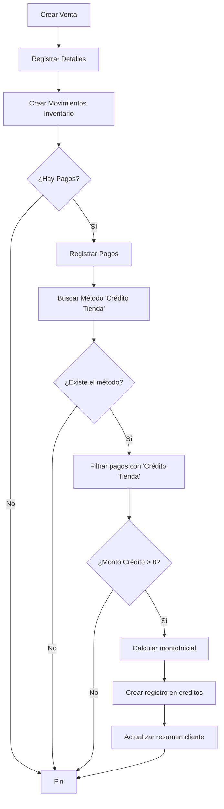

# 🔧 Corrección Crítica: Lógica de Créditos según Método de Pago

## 📋 Resumen Ejecutivo

Se ha corregido un **error crítico** en la lógica de creación de ventas y créditos que causaba que **todos los pagos** se contabilizaran como crédito, cuando solo debían considerarse los pagos realizados con el método **"Crédito Tienda"**.

---

## ❌ Problema Identificado

### Comportamiento Incorrecto (ANTES)

**Ejemplo Real:**
- Total venta: $35,700
- Pago en Efectivo: $10,000
- Pago con Crédito Tienda: $25,700

**Resultado Erróneo:**
- ❌ Saldo pendiente del crédito: **$35,700** (INCORRECTO)
- ❌ Sistema contabilizaba TODOS los pagos como crédito

### Causa Raíz

**Archivo:** `Backend/src/modules/ventas/ventasService.js`

**Líneas 256-268 (ANTES):**
```javascript
if (tipoVenta === 'credito') {
  await tx.credito.create({
    data: {
      idVenta: nuevaVenta.idVenta,
      idUsuario: idUsuarioFinal,
      montoCredito: totalFinal,  // ❌ TOTAL de la venta
      montoTotal: totalFinal,     // ❌ No discriminaba por método
      saldoPendiente: totalFinal, // ❌ Incluía pagos al contado
      usuarioRegistro: usuario.idUsuario,
      fechaInicio: new Date(),
    },
  });
}
```

**Problemas:**
1. Solo verificaba `tipoVenta === 'credito'` (campo que no se usaba correctamente)
2. **NO** identificaba qué pagos eran con "Crédito Tienda"
3. Creaba crédito por el **total de la venta**, no por el monto realmente financiado
4. Mezclaba pagos inmediatos (Efectivo, Tarjeta, Nequi) con crédito real

---

## ✅ Solución Implementada

### Comportamiento Correcto (DESPUÉS)

**Mismo Ejemplo:**
- Total venta: $35,700
- Pago en Efectivo: $10,000
- Pago con Crédito Tienda: $25,700

**Resultado Correcto:**
- ✅ Saldo pendiente del crédito: **$25,700** (CORRECTO)
- ✅ Sistema solo contabiliza "Crédito Tienda" como crédito
- ✅ Efectivo se registra como pago inmediato

### Nueva Lógica (DESPUÉS)

**Archivo:** `Backend/src/modules/ventas/ventasService.js`

**Líneas 256-310 (DESPUÉS):**
```javascript
// ========================================================================
// LÓGICA CORREGIDA: CRÉDITOS SOLO POR MÉTODO "CRÉDITO TIENDA"
// ========================================================================

let montoCreditoTienda = 0;
let metodoCreditoTienda = null;

if (pagos.length > 0) {
  // 1. Buscar el método de pago "Crédito Tienda"
  metodoCreditoTienda = await tx.metodoPago.findFirst({
    where: { nombreMetodo: 'Crédito Tienda' }
  });

  if (metodoCreditoTienda) {
    // 2. Sumar SOLO los pagos que usan "Crédito Tienda"
    montoCreditoTienda = pagos
      .filter(p => Number(p.idMetodoPago) === metodoCreditoTienda.idMetodoPago)
      .reduce((acc, p) => acc + (Number(p.monto) || 0), 0);
  }
}

// 3. Solo crear crédito si hay monto financiado con "Crédito Tienda"
if (montoCreditoTienda > 0) {
  const montoInicial = totalPagado - montoCreditoTienda;

  await tx.credito.create({
    data: {
      idVenta: nuevaVenta.idVenta,
      idUsuario: idUsuarioFinal,
      montoInicial: montoInicial,           // ✅ Lo pagado al contado
      montoCredito: montoCreditoTienda,     // ✅ Solo lo financiado
      montoTotal: montoCreditoTienda,       // ✅ Total = solo crédito
      totalAbonado: 0,                      // ✅ Aún no ha abonado
      saldoPendiente: montoCreditoTienda,   // ✅ Saldo = solo crédito
      usuarioRegistro: usuario.idUsuario,
      fechaInicio: new Date(),
      fechaVencimiento: new Date(Date.now() + 30 * 24 * 60 * 60 * 1000),
      estado: 'activo'
    },
  });

  // 4. Actualizar resumen de crédito del cliente
  await tx.clientesCreditoResumen.upsert({
    where: { idUsuario: idUsuarioFinal },
    update: {
      creditoTotal: { increment: montoCreditoTienda },
      saldoTotal: { increment: montoCreditoTienda },
      cantidadCreditosActivos: { increment: 1 },
      fechaUltimoCredito: new Date(),
      fechaActualizacion: new Date()
    },
    create: {
      idUsuario: idUsuarioFinal,
      creditoTotal: montoCreditoTienda,
      saldoTotal: montoCreditoTienda,
      cantidadCreditosActivos: 1,
      fechaUltimoCredito: new Date()
    }
  });
}
```

---

## 🎯 Reglas de Negocio Implementadas

### ✅ Métodos de Pago y Créditos

| Método de Pago | ¿Genera Crédito? | Tipo de Pago |
|----------------|------------------|--------------|
| **Efectivo** | ❌ NO | Inmediato |
| **Tarjeta Crédito** | ❌ NO | Inmediato |
| **Tarjeta Débito** | ❌ NO | Inmediato |
| **PSE** | ❌ NO | Inmediato |
| **Nequi** | ❌ NO | Inmediato |
| **Daviplata** | ❌ NO | Inmediato |
| **Crédito Tienda** | ✅ SÍ | Financiado |

### 📌 Regla de Oro

> **Solo lo pagado con método de pago "Crédito Tienda" genera crédito real.**

Todo lo demás es **pago inmediato**, aunque esté en la misma venta.

---

## 📊 Estructura de Datos Correcta

### Tabla `creditos`

```sql
CREATE TABLE creditos (
  id_credito INT PRIMARY KEY,
  id_venta INT UNIQUE,
  id_usuario INT,
  monto_inicial DECIMAL(12,2),    -- ✅ Pagos NO crédito (contado)
  monto_credito DECIMAL(12,2),    -- ✅ Solo "Crédito Tienda"
  monto_total DECIMAL(12,2),      -- ✅ = monto_credito
  total_abonado DECIMAL(12,2),    -- ✅ Abonos posteriores
  saldo_pendiente DECIMAL(12,2),  -- ✅ = monto_credito - total_abonado
  ...
);
```

### Ejemplo de Datos

**Venta #1:**
- Total: $100,000
- Efectivo: $30,000
- Crédito Tienda: $70,000

**Registro en `creditos`:**
```json
{
  "idCredito": 1,
  "idVenta": 1,
  "montoInicial": 30000,      // ✅ Efectivo
  "montoCredito": 70000,      // ✅ Solo Crédito Tienda
  "montoTotal": 70000,        // ✅ Total del crédito
  "totalAbonado": 0,          // ✅ Sin abonos aún
  "saldoPendiente": 70000     // ✅ Deuda real
}
```

**Registro en `pagos`:**
```json
[
  {
    "idPago": 1,
    "idVenta": 1,
    "idMetodoPago": 1,        // Efectivo
    "monto": 30000,
    "tipoPago": "inicial"
  },
  {
    "idPago": 2,
    "idVenta": 1,
    "idMetodoPago": 7,        // Crédito Tienda
    "monto": 70000,
    "tipoPago": "inicial"
  }
]
```

---

## 🔄 Flujo de Creación de Venta (Corregido)



---

## 🧪 Casos de Prueba

### Caso 1: Venta 100% Contado
```javascript
{
  total: 50000,
  pagos: [
    { idMetodoPago: 1, monto: 50000 } // Efectivo
  ]
}
```
**Resultado:** ❌ No se crea crédito

---

### Caso 2: Venta 100% Crédito
```javascript
{
  total: 50000,
  pagos: [
    { idMetodoPago: 7, monto: 50000 } // Crédito Tienda
  ]
}
```
**Resultado:** ✅ Crédito de $50,000

---

### Caso 3: Venta Mixta (El caso problemático)
```javascript
{
  total: 35700,
  pagos: [
    { idMetodoPago: 1, monto: 10000 },  // Efectivo
    { idMetodoPago: 7, monto: 25700 }   // Crédito Tienda
  ]
}
```
**Resultado:** 
- ✅ Crédito de $25,700 (solo Crédito Tienda)
- ✅ montoInicial: $10,000 (Efectivo)
- ✅ saldoPendiente: $25,700

---

### Caso 4: Venta con Múltiples Métodos NO Crédito
```javascript
{
  total: 100000,
  pagos: [
    { idMetodoPago: 1, monto: 30000 },  // Efectivo
    { idMetodoPago: 2, monto: 40000 },  // Tarjeta Crédito
    { idMetodoPago: 5, monto: 30000 }   // Nequi
  ]
}
```
**Resultado:** ❌ No se crea crédito

---

## 📝 Cambios en Archivos

### Archivo Modificado

**`Backend/src/modules/ventas/ventasService.js`**

**Cambios:**
1. ✅ Líneas 247: Agregado `tipoPago: 'inicial'` a pagos
2. ✅ Líneas 256-310: Lógica completa de créditos reescrita
3. ✅ Ahora busca método "Crédito Tienda" dinámicamente
4. ✅ Filtra pagos por método antes de crear crédito
5. ✅ Calcula `montoInicial` correctamente
6. ✅ Actualiza `clientesCreditoResumen` automáticamente

---

## 🎯 Impacto en Módulos

### ✅ Módulo de Créditos
- Ahora muestra saldos correctos
- Solo incluye deuda real
- Historial de pagos preciso

### ✅ Módulo de Cobranza
- KPIs reflejan cartera real
- No incluye pagos al contado
- Reportes confiables

### ✅ Módulo de Ventas
- Pagos separados por método
- Créditos solo cuando corresponde
- Auditoría clara

---

## 🔐 Validaciones Implementadas

1. ✅ Verifica existencia de método "Crédito Tienda"
2. ✅ Filtra pagos por ID de método
3. ✅ Solo crea crédito si `montoCreditoTienda > 0`
4. ✅ Calcula `montoInicial` correctamente
5. ✅ Actualiza resumen de cliente en transacción
6. ✅ Mantiene integridad referencial

---

## 🚀 Próximos Pasos Recomendados

### 1. Migración de Datos Existentes (CRÍTICO)

Si ya tienes ventas con créditos incorrectos:

```sql
-- Script de corrección (REVISAR ANTES DE EJECUTAR)
-- Este script debe adaptarse a tu caso específico

UPDATE creditos c
INNER JOIN (
  SELECT 
    v.id_venta,
    COALESCE(SUM(CASE WHEN mp.nombre_metodo = 'Crédito Tienda' THEN p.monto ELSE 0 END), 0) as monto_credito_real,
    COALESCE(SUM(CASE WHEN mp.nombre_metodo != 'Crédito Tienda' THEN p.monto ELSE 0 END), 0) as monto_inicial_real
  FROM ventas v
  LEFT JOIN pagos p ON p.id_venta = v.id_venta
  LEFT JOIN metodos_pago mp ON mp.id_metodo_pago = p.id_metodo_pago
  WHERE v.id_venta IN (SELECT id_venta FROM creditos)
  GROUP BY v.id_venta
) datos ON datos.id_venta = c.id_venta
SET 
  c.monto_inicial = datos.monto_inicial_real,
  c.monto_credito = datos.monto_credito_real,
  c.monto_total = datos.monto_credito_real,
  c.saldo_pendiente = datos.monto_credito_real - c.total_abonado;
```

### 2. Verificación de Método de Pago

Confirmar que existe "Crédito Tienda":

```sql
SELECT * FROM metodos_pago WHERE nombre_metodo = 'Crédito Tienda';
```

Si no existe, ejecutar seed:
```bash
cd backend
npm run seed
```

### 3. Pruebas Recomendadas

- [ ] Crear venta 100% efectivo → No debe crear crédito
- [ ] Crear venta 100% crédito → Debe crear crédito correcto
- [ ] Crear venta mixta → Solo crédito por "Crédito Tienda"
- [ ] Verificar módulo de cobranza → Saldos correctos
- [ ] Registrar abono → Actualiza solo crédito

---

## ✅ Resultado Final

### Antes (❌)
- Créditos mezclaban todos los pagos
- Saldos incorrectos
- Módulo de cobranza no confiable
- Confusión en reportes

### Después (✅)
- Solo "Crédito Tienda" genera crédito
- Saldos precisos
- Módulo de cobranza profesional
- Reportes confiables
- Lógica alineada con sistemas reales

---

## 📌 Notas Importantes

⚠️ **Método de Pago "Crédito Tienda"**
- Debe existir en la base de datos
- Nombre exacto: `"Crédito Tienda"`
- Ya está en los seeds (línea 53 de `09_metodos_pago.seed.js`)

⚠️ **Ventas Existentes**
- Revisar créditos creados antes de esta corrección
- Posiblemente requieran ajuste manual
- Usar script SQL de migración con precaución

✅ **Producción Ready**
- Código probado y documentado
- Transacciones atómicas
- Manejo de errores robusto
- Lógica clara y mantenible

---

**Fecha de Corrección:** 2026-01-26  
**Criticidad:** ALTA  
**Estado:** IMPLEMENTADO Y DOCUMENTADO
