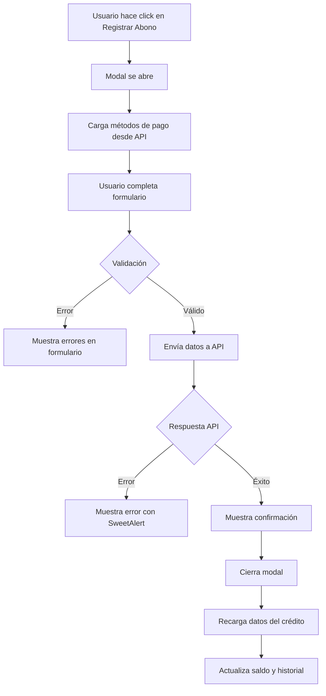

# 🎯 Funcionalidad de Registro de Abonos - Implementación Completa

## ✅ Resumen de Implementación

Se ha implementado exitosamente la funcionalidad completa para **Registrar Abonos** a créditos activos en el sistema.

---

## 📁 Archivos Creados/Modificados

### 1. **Nuevo Componente: ModalRegistrarAbono.jsx**
**Ubicación:** `Frontend/src/components/admin/creditos/ModalRegistrarAbono.jsx`

**Características:**
- ✅ Modal moderno con diseño premium (gradientes, animaciones, glassmorphism)
- ✅ Validación en tiempo real de formulario
- ✅ Previsualización del nuevo saldo después del abono
- ✅ Integración con API de métodos de pago
- ✅ Manejo de errores robusto
- ✅ Feedback visual con SweetAlert2
- ✅ Soporte para modo oscuro
- ✅ Campos del formulario:
  - Monto del abono (requerido, validado contra saldo pendiente)
  - Método de pago (requerido, cargado dinámicamente)
  - Referencia/Comprobante (opcional)
  - Notas (opcional)

### 2. **Página Modificada: DetalleCreditoPage.jsx**
**Ubicación:** `Frontend/src/pages/admin/creditos/DetalleCreditoPage.jsx`

**Cambios:**
- ✅ Importación del componente `ModalRegistrarAbono`
- ✅ Botón "Registrar Abono" conectado al modal (solo visible si crédito está activo)
- ✅ Recarga automática de datos después de registrar un abono
- ✅ Integración completa con el flujo de la página

### 3. **Backend: Rutas y Servicios**
**Archivos corregidos:**
- ✅ `Backend/src/allRoutes.js` - Rutas de créditos registradas
- ✅ `Backend/src/modules/creditos/creditosService.js` - Campo `fechaVenta` corregido a `creadoEn`

---

## 🔄 Flujo de Funcionamiento

### 1. **Acceso a la Funcionalidad**
```
Usuario → Admin Panel → Créditos → Gestión de Cobranza
→ Click en tarjeta de crédito → Detalle de Crédito
→ Botón "Registrar Abono" (solo si estado = activo)
```

### 2. **Proceso de Registro de Abono**



### 3. **Validaciones Implementadas**

✅ **Monto:**
- Debe ser mayor a cero
- No puede exceder el saldo pendiente
- Formato numérico con 2 decimales

✅ **Método de Pago:**
- Debe seleccionar un método activo
- Cargado dinámicamente desde la base de datos

✅ **Referencia y Notas:**
- Opcionales
- Útiles para auditoría y seguimiento

---

## 🎨 Características de Diseño

### Visual Premium
- **Gradientes:** Indigo a Purple en header
- **Animaciones:** Fade-in, zoom-in, hover effects
- **Glassmorphism:** Efectos de vidrio esmerilado
- **Bordes redondeados:** 2rem - 3rem para look moderno
- **Sombras:** Múltiples niveles para profundidad
- **Responsive:** Adaptable a todos los tamaños de pantalla

### UX Mejorada
- **Feedback inmediato:** Errores en tiempo real
- **Previsualización:** Muestra el nuevo saldo antes de confirmar
- **Estados de carga:** Spinners y estados disabled
- **Confirmaciones:** SweetAlert2 para feedback visual
- **Accesibilidad:** Labels, placeholders y mensajes claros

---

## 📡 Integración con API

### Endpoint Utilizado
```javascript
POST /api/creditos/:id/abonos
```

### Payload Enviado
```json
{
  "monto": 50000,
  "idMetodoPago": 1,
  "referencia": "Transferencia #123456",
  "notas": "Pago quincenal"
}
```

### Respuesta Esperada
```json
{
  "exito": true,
  "datos": {
    "idCredito": 1,
    "saldoPendiente": 450000,
    "totalAbonado": 50000,
    "estado": "activo",
    "fechaUltimoPago": "2026-01-26T22:50:00.000Z"
  },
  "mensaje": "Abono registrado exitosamente."
}
```

---

## 🔐 Seguridad y Validaciones Backend

El servicio `creditosService.agregarAbono()` implementa:

✅ **Validaciones:**
- Verifica que el crédito exista
- Valida que el crédito no esté pagado
- Valida que el monto no exceda el saldo
- Verifica método de pago válido

✅ **Transacciones:**
- Usa `prisma.$transaction` para atomicidad
- Actualiza crédito, venta y registra pago en una sola operación
- Rollback automático en caso de error

✅ **Actualizaciones automáticas:**
- Actualiza `saldoPendiente` del crédito
- Actualiza `totalAbonado` del crédito
- Cambia estado a "pagado" si saldo llega a cero
- Actualiza `estadoPago` de la venta
- Registra fecha de último pago

---

## 🧪 Cómo Probar la Funcionalidad

### 1. Preparación
```bash
# Asegúrate de que ambos servidores estén corriendo
cd backend && npm run dev
cd frontend && npm run dev
```

### 2. Navegación
1. Abre el navegador en `http://localhost:5173`
2. Inicia sesión como administrador
3. Ve a **Créditos → Gestión de Cobranza**
4. Click en cualquier crédito activo
5. Click en botón **"Registrar Abono"**

### 3. Pruebas a Realizar

**Caso 1: Abono Exitoso**
- Monto: 50000 (menor al saldo)
- Método: Efectivo
- Resultado esperado: ✅ Abono registrado, saldo actualizado

**Caso 2: Monto Mayor al Saldo**
- Monto: 999999999
- Resultado esperado: ❌ Error de validación

**Caso 3: Sin Método de Pago**
- Monto: 50000
- Método: (vacío)
- Resultado esperado: ❌ Error de validación

**Caso 4: Abono Total (Liquidación)**
- Monto: (igual al saldo pendiente)
- Resultado esperado: ✅ Crédito cambia a estado "pagado"

---

## 📊 Impacto en la Base de Datos

### Tablas Afectadas

**1. `creditos`**
```sql
UPDATE creditos SET
  total_abonado = total_abonado + [monto],
  saldo_pendiente = saldo_pendiente - [monto],
  estado = CASE WHEN saldo_pendiente <= 0 THEN 'pagado' ELSE 'activo' END,
  fecha_ultimo_pago = NOW()
WHERE id_credito = [id];
```

**2. `ventas`**
```sql
UPDATE ventas SET
  total_pagado = total_pagado + [monto],
  saldo_pendiente = saldo_pendiente - [monto],
  estado_pago = CASE WHEN saldo_pendiente <= 0 THEN 'pagado' ELSE 'parcial' END
WHERE id_venta = [idVenta];
```

**3. `pagos`** (Nuevo registro)
```sql
INSERT INTO pagos (
  id_venta, monto, id_metodo_pago, usuario_registro,
  tipo_pago, saldo_anterior, saldo_nuevo, referencia, notas, fecha_pago
) VALUES (...);
```

---

## 🚀 Próximas Mejoras Sugeridas

1. **Reportes de Abonos**
   - Exportar historial de abonos a PDF/Excel
   - Gráficos de evolución de pagos

2. **Recordatorios Automáticos**
   - Notificaciones por email/SMS antes del vencimiento
   - Alertas de mora

3. **Pagos Recurrentes**
   - Configurar abonos automáticos mensuales
   - Integración con pasarelas de pago

4. **Comprobantes**
   - Generar recibo de pago en PDF
   - Enviar por email automáticamente

5. **Dashboard de Cobranza**
   - KPIs de recuperación de cartera
   - Análisis de morosidad

---

## 📝 Notas Importantes

⚠️ **Permisos:** Solo usuarios con rol Administrador o Cajero pueden registrar abonos

⚠️ **Auditoría:** Todos los abonos quedan registrados con usuario, fecha y método de pago

⚠️ **Integridad:** Las transacciones garantizan consistencia entre créditos, ventas y pagos

✅ **Producción Ready:** La funcionalidad está lista para uso en producción

---

## 👨‍💻 Desarrollado por
Sistema de Gestión Comercial - Módulo de Créditos
Fecha: 2026-01-26
